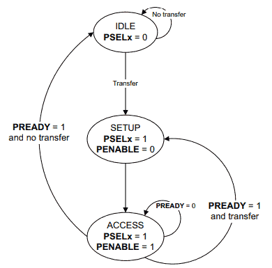

# apb_slave — APB4 Register Slave


A compact, synthesizable APB4 peripheral compliant with the **ARM AMBA APB Protocol Specification (IHI0024)**. Contains a `7 x 32-bit` R/W register bank and one live read-only STATUS register. Completes every transfer in zero wait states and supports byte-lane writes via `PSTRB[3:0]`.

> 📖 **Full Technical Specification & Architecture Manual:** Xem tài liệu chi tiết 11 chương tại [`docs/apb_slave_document.md`](docs/apb_slave_document.md).

---

## 📌 Architecture & Key Principles

### Block Diagram

```text
                   +-----------------------------------------+
  APB Master       |               apb_slave                 |
  (Bridge)         |                                         |
                   |  +-------------+    +---------------+   |
  PSEL  ---------->|  |   Address   |    |  Register     |   +---> o_reg0
  PENABLE -------->|  |   Decoder   |--> |  Bank         |   +---> o_reg1
  PWRITE --------->|  |             |    |  r_regs[0:6]  |   +---> o_reg2
  PADDR[7:0] ----->|  | w_addr_valid|    |               |   +---> o_reg3
  PWDATA[31:0] --->|  | w_write     |    |  32-bit x 7   |   +---> o_reg4
  PSTRB[3:0] ----->|  +-------------+    +-------+-------+   +---> o_reg5
                   |                             |           +---> o_reg6
  PREADY <---------|--- 1'b1 (constant)          |           |
  PRDATA[31:0] <---|--- Read MUX <---------------+           |
  PSLVERR <--------|--- Error Logic                          |
                   |                                         |
  i_status[31:0] ->|--- STATUS Reg (R/O, live)               |
                   +-----------------------------------------+
```

### 2-Phase Protocol Handshake & State Machine (ARM IHI0024)

The bus operation is governed by a 3-state finite state machine defined in the ARM APB specification:

<p align="center">
  
</p>

* **IDLE (`PSEL=0, PENABLE=0`):** Default bus state. No transfer is pending.
* **SETUP (`PSEL=1, PENABLE=0`):** Initiates a transfer. Address (`PADDR`), command (`PWRITE`), and write data (`PWDATA`) are asserted and remain stable for exactly one cycle.
* **ACCESS (`PSEL=1, PENABLE=1`):** Transfer phase. Handshake completes on the rising edge of `PCLK` when `PREADY == 1`:
  * **Wait State (`PREADY=0`):** Bus remains in ACCESS if the slave requests additional cycles.
  * **Normal Exit (`PREADY=1` & No transfer):** Returns to `IDLE`.
  * **Back-to-Back (`PREADY=1` & New transfer):** Transitions directly to `SETUP` without an intervening `IDLE` cycle.

> 💡 *Note: In this module, `PREADY` is tied to `1'b1` (Zero Wait-State), so every transfer executes in exactly 2 clock cycles (1 Setup + 1 Access).* Detailed cycle-by-cycle waveforms are documented in [`docs/apb_slave_document.md`](docs/apb_slave_document.md).

---

## 🔌 Interface

### APB Bus Signals
| Signal | Dir | Width | Description |
|---|:---:|---:|---|
| `pclk` | In | 1 | APB clock |
| `presetn` | In | 1 | Active-low asynchronous reset |
| `psel` | In | 1 | Peripheral select (Setup: `PSEL=1, PENABLE=0`) |
| `penable` | In | 1 | Access phase qualifier (`PENABLE=1` active) |
| `pwrite` | In | 1 | `1` = Write transaction, `0` = Read transaction |
| `paddr` | In | 8 | Byte address (`0x00–0x1C`, 4-byte aligned) |
| `pwdata` | In | 32 | Write data bus |
| `pstrb` | In | 4 | Write byte enables (`pstrb[n]=1` enables byte lane `n`) |
| `prdata` | Out | 32 | Read data (combinational — valid during Access phase) |
| `pready` | Out | 1 | Always `1` — zero-wait-state slave |
| `pslverr` | Out | 1 | Error response (asserted during Access on bad address) |

### Application Interface
| Signal | Dir | Width | Description |
|---|:---:|---:|---|
| `i_status` | In | 32 | Live read-only status input (mapped to `0x1C`) |
| `o_reg0` … `o_reg6` | Out | 32 | Dedicated parallel outputs for registers 0 to 6 |

---

## ⚙️ Parameters

| Parameter | Default | Description |
|---|---:|---|
| `RESET_VALUE` | `32'h0000_0000` | Asynchronously loaded into all R/W registers upon `!presetn` |

---

## 🗺️ Register Map

| Address | Register | Access | Connected to | Description |
|---:|---|:---:|---|---|
| `0x00` | REG0 | R/W | `o_reg0` | General-purpose register 0 |
| `0x04` | REG1 | R/W | `o_reg1` | General-purpose register 1 |
| `0x08` | REG2 | R/W | `o_reg2` | General-purpose register 2 |
| `0x0C` | REG3 | R/W | `o_reg3` | General-purpose register 3 |
| `0x10` | REG4 | R/W | `o_reg4` | General-purpose register 4 |
| `0x14` | REG5 | R/W | `o_reg5` | General-purpose register 5 |
| `0x18` | REG6 | R/W | `o_reg6` | General-purpose register 6 |
| `0x1C` | STATUS | **R/O** | ← `i_status` | Live status — writes silently ignored |

* **Address decoding rule:** Valid addresses satisfy `PADDR[7:5] == 3'b000` (range `0x00–0x1F`) and `PADDR[1:0] == 2'b00` (4-byte alignment).
* **Byte Strobe Control:** `PSTRB[0]` governs `[7:0]`, `PSTRB[1]` governs `[15:8]`, `PSTRB[2]` governs `[23:16]`, `PSTRB[3]` governs `[31:24]`.

---

## 🚀 How to Run

### ModelSim / Questa
```bash
cd sim/modelsim
make sim        # Batch simulation — auto-exits PASS / FAIL
make gui        # Interactive GUI with preconfigured waveform (wave.do)
make clean      # Clean compilation artifacts
```

### Vivado xsim
```bash
cd sim/xsim
make sim        # Batch simulation via xsim
make gui        # Vivado waveform GUI
make clean
```

---

## 🖥️ Simulation Results

Verified on **2026-09-03** with **Questa 2025.2** and **Vivado xsim 2025.2**:

```text
[TEST] T1: reset and idle outputs
[PASS] PREADY is always asserted
[PASS] all R/W registers reset to RESET_VALUE
[PASS] idle response is clean
[TEST] T2: full-word read and write
[PASS] full-word write reads back correctly
[TEST] T3: APB4 byte strobes
[PASS] PSTRB updates only selected byte lanes
[PASS] zero strobe leaves register unchanged
[TEST] T4: read-only status register
[PASS] STATUS reflects live input
[PASS] STATUS ignores writes without reporting an error
[TEST] T5: invalid and misaligned addresses
[PASS] out-of-range read returns zero and PSLVERR
[PASS] misaligned write reports PSLVERR and changes no data
[TEST] T6: back-to-back transfers
[PASS] consecutive transfers complete without an idle cycle
==================================================
           SIMULATION SUMMARY REPORT
==================================================
  Total Test Scenarios   : 6 (T1 - T6)
  Assertion Checks Run   : 11
  Assertion Errors       : 0
==================================================
  FINAL RESULT: ALL TESTS PASSED
==================================================
Time: 380 ns  Errors: 0, Warnings: 0
```

Simulation completed with **0 errors**.

---

## ✅ Test Cases

| ID | Scenario | Stimulus & Expected Behavior | Result |
|:--:|---|---|:---:|
| **T1** | Reset & Idle bus | Verify all 7 registers reset to `RESET_VALUE`, `PREADY=1`, clean idle outputs | ✅ Pass |
| **T2** | Full-word R/W | Write `0x12345678` with `PSTRB=4'hF`, read back matches with no error | ✅ Pass |
| **T3** | APB4 Byte Strobes | Partial write (`PSTRB=4'b0101`), zero-strobe (`PSTRB=0`) leaves data intact | ✅ Pass |
| **T4** | STATUS Register | Read reflects live `i_status`; write is ignored without raising `PSLVERR` | ✅ Pass |
| **T5** | Invalid & Misaligned | Out-of-range (`0x20`) and unaligned (`0x02`) assert `PSLVERR`, no data corruption | ✅ Pass |
| **T6** | Back-to-back Transfers | Consecutive transfers run with no idle cycle (`PENABLE` toggles, `PSEL` high) | ✅ Pass |

Detailed verification contract: [`docs/test_plan.md`](docs/test_plan.md).

---

## ⚖️ APB4 vs AXI4-Lite

| Property | APB4 | AXI4-Lite |
|---|---|---|
| **Channels** | 1 shared multiplexed channel | 5 dedicated independent channels (AW, W, B, AR, R) |
| **Handshake** | 2-phase: Setup then Access | Independent VALID / READY handshakes |
| **Outstanding** | 1 transfer at a time | Multiple outstanding supported |
| **Back-pressure** | `PREADY` de-assertion (wait states) | Channel-specific `READY` de-assertion |
| **Byte strobe** | `PSTRB[3:0]` | `WSTRB[3:0]` |
| **Area / Power** | Minimal logic gates, low power | Higher gate count, complex routing |
| **Typical use** | Control registers, slow peripherals | High-speed memory-mapped registers, DMA |

---

## ⚠️ Known Limitations & Design Choices

| # | Design Choice / Limitation | Rationale / Suggested Extension |
|---|---|---|
| 1 | **Hardwired `PREADY = 1`** | Optimized for on-chip register access with zero wait states. If mapped to slow memory, implement wait-state counter. |
| 2 | **Omission of `PPROT[2:0]`** | Slaves in this subsystem do not require Secure/Privileged isolation. Saves pin count and decoding logic. |
| 3 | **Combinational Read Data (`PRDATA`)** | ARM APB requires data valid in the Access phase. For very high clock frequencies, register slice may be added on bus boundary. |
| 4 | **Fixed 32-bit Data Bus** | Standard APB word size. Byte accesses are handled using `PSTRB` rather than sub-word bus sizing. |
| 5 | **STATUS Write Acceptance** | Writes to `0x1C` return clean response without mutating status, following standard SoC dummy-write conventions. |

---

## 📁 File Structure

```text
01_ip_blocks/apb_slave/
├── rtl/
│   └── apb_slave.v            # Synthesizable APB4 zero-wait slave (95 lines)
├── sim/
│   ├── apb_slave_tb.v         # Self-checking testbench (11 checks, watchdog)
│   ├── modelsim/              # Questa / ModelSim flow
│   │   ├── Makefile
│   │   └── wave.do            # Pre-configured colored signal wave
│   └── xsim/                  # Vivado simulator flow
│       └── Makefile
├── constraints/
│   └── timing.xdc             # 100 MHz clock constraint (period 10.0 ns)
├── docs/
│   ├── apb_slave_document.md  # Comprehensive architecture & compliance manual (626 lines)
│   └── test_plan.md           # Verification specification and criteria
└── README.md                  # This file
```

---

## 📚 References

1. [ARM AMBA APB Architecture Specification (ARM IHI0024E)](https://developer.arm.com/documentation/ihi0024/latest/) — Official ARM APB4 specification.
2. [APB Slave Technical Specification & Architecture Manual](docs/apb_slave_document.md) — Comprehensive architectural document, compliance matrix, and timing diagrams.
3. [Verification Plan](docs/test_plan.md) — Test requirements, corner cases, and pass/fail criteria.
4. [Cap-stone Mini SoC Integration](../../05_mini_soc/) — Peripheral integration into the top-level subsystem.
