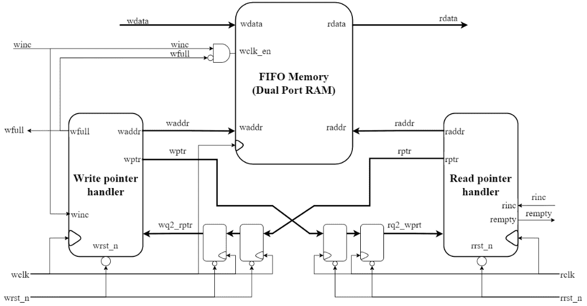

# async_fifo_gray — Asynchronous FIFO with Gray Code CDC


Asynchronous FIFO using **Gray code pointers** and **2-FF synchronizers** for safe Clock Domain Crossing (CDC). Upgraded from the foundational design in `rtl-design-practice` into a modular, industry-style IP block.

---

## 📌 Upgrade Summary (from `rtl-design-practice`)

| Feature | rtl-design-practice (original) | rtl-advanced-projects (this) |
|---------|-------------------------------|------------------------------|
| Architecture | Monolithic single file | **Modular**: `gray_counter` + `sync_2ff` + top |
| Reset | Shared `rst_n` both domains | **Per-domain** `wr_rst_n`, `rd_rst_n` |
| Read port | Registered (1 extra cycle latency) | **Async/combinational** (lower latency) |
| Word count | Not available | `o_wr_count`, `o_rd_count` added |
| FPGA attribute | Not set | **`(* ASYNC_REG = "TRUE" *)`** on sync FFs |
| Port naming | `wr_clk`, `din`, etc. | **`i_/o_` prefix** per RTL coding guidelines |
| Timing constraints | Not included | **`timing.xdc`** with `set_clock_groups` |

---

### Reference Architecture Diagram

Below is the visual representation of the Async FIFO architecture, highlighting the clock domains, memory array, Gray-code pointer conversions, and the 2-stage Flip-Flop synchronizers:

> *Reference: Architecture diagram adapted from [ujjwal-2001/Async_FIFO_Design](https://github.com/ujjwal-2001/Async_FIFO_Design).*

<p align="center">
  
</p>

**Key principle (Cliff Cummings, SNUG 2002):**
- Gray code → only 1 bit flips per increment → safe to sample across clock domains
- 2-FF synchronizer → resolves metastability
- Full: `wr_gray == {~rd_gray_sync[MSB:MSB-1], rd_gray_sync[MSB-2:0]}`
- Empty: `rd_gray == wr_gray_sync`

---

## 🔌 Port List

### Write Domain
| Signal | Dir | Width | Description |
|--------|-----|-------|-------------|
| `i_wr_clk` | in | 1 | Write clock |
| `i_wr_rst_n` | in | 1 | Async reset, active-low (write domain) |
| `i_wr_en` | in | 1 | Write enable |
| `i_wr_data` | in | DATA_WIDTH | Write data |
| `o_full` | out | 1 | FIFO full flag |
| `o_wr_count` | out | ADDR_WIDTH+1 | Entries count (write domain view) |

### Read Domain
| Signal | Dir | Width | Description |
|--------|-----|-------|-------------|
| `i_rd_clk` | in | 1 | Read clock |
| `i_rd_rst_n` | in | 1 | Async reset, active-low (read domain) |
| `i_rd_en` | in | 1 | Read enable |
| `o_rd_data` | out | DATA_WIDTH | Read data (combinational) |
| `o_empty` | out | 1 | FIFO empty flag |
| `o_rd_count` | out | ADDR_WIDTH+1 | Entries count (read domain view) |

---

## ⚙️ Parameters

| Parameter | Default | Description |
|-----------|---------|-------------|
| `DATA_WIDTH` | 8 | Data bus width |
| `ADDR_WIDTH` | 4 | Depth = 2^ADDR_WIDTH (default: 16 entries) |

---

## 🖥️ Simulation Results

```
==== Async FIFO Gray -- TB (DW=8 DEPTH=16) ====
-- T1: Write 8 / Read 8 --
-- T2: Fill to FULL --
[PASS] FULL asserted
-- T3: Drain to EMPTY --
[PASS] EMPTY asserted
-- T4: Concurrent wr>rd --
-- T5: Concurrent rd>wr --
================================================
  RESULT: ALL TESTS PASSED
================================================
```

Simulation completed with **0 errors** (Vivado xsim / ModelSim Questa).

---

## 🚀 How to Run

### ModelSim / Questa
```bash
cd sim/modelsim
make sim        # Batch/headless — nhanh nhất, CI-friendly
make gui        # GUI + styled waveform
make do         # Standalone .do (no make needed)
make clean
```

### Vivado xsim
```bash
cd sim/xsim
make sim
make gui
make clean
```

### Portable (without Make)
```bash
# Vivado xsim
cd sim/xsim && xtclsh simulate.tcl

# ModelSim / Questa
cd sim/modelsim && vsim -c -do simulate.do
```

---

## ✅ Test Cases

| ID | Scenario | Expected | Result |
|----|----------|----------|--------|
| TC1 | Write 8, read 8 | Data matches in order | ✅ Pass |
| TC2 | Fill beyond depth (20 writes) | `o_full` asserted at depth=16 | ✅ Pass |
| TC3 | Read all entries | `o_empty` asserted | ✅ Pass |
| TC4 | Concurrent W>R | No data loss, no metastability | ✅ Pass |
| TC5 | Concurrent R>W | No spurious reads | ✅ Pass |

Detailed verification intent: [docs/test_plan.md](docs/test_plan.md)

---

## 📁 File Structure

```text
01_ip_blocks/async_fifo_gray/
├── rtl/
│   ├── async_fifo.v        ← Top-level FIFO (modular, parameterized)
│   ├── gray_counter.v      ← Binary + Gray counter sub-module
│   └── sync_2ff.v          ← 2-FF CDC synchronizer (ASYNC_REG attribute)
├── sim/
│   ├── async_fifo_tb.v     ← Self-checking testbench (5 tests, watchdog)
│   ├── modelsim/           ← make sim | gui | do | clean
│   │   ├── Makefile
│   │   ├── simulate.do     ← Standalone batch (vsim -c -do simulate.do)
│   │   └── wave.do         ← Styled waveform: colors, dividers, zoom
│   └── xsim/              ← make sim | gui | clean
│       ├── Makefile
│       ├── simulate.tcl    ← Standalone batch (xtclsh simulate.tcl)
│       └── wave.tcl        ← Waveform config (xsim GUI)
├── constraints/
│   └── timing.xdc          ← set_clock_groups -asynchronous
├── docs/
│   └── test_plan.md        ← Verification plan (5 test cases)
└── README.md               ← This file
```

---

## ⚠️ Known Limitations

| # | Limitation | Suggested Extension |
|---|------------|---------------------|
| 1 | `o_wr_count` / `o_rd_count` use binary subtraction across domains | Use synchronized gray pointer for accurate cross-domain count |
| 2 | No `almost_full` / `almost_empty` threshold flags | Add programmable watermark parameters |
| 3 | Single write / single read per cycle only | Extend to burst-capable with AXI-Stream interface |
| 4 | Behavioral RAM — not technology mapped | Replace `mem[]` with FPGA BRAM primitive for synthesis |
| 5 | No ECC on stored data | Add Hamming code for single-bit error correction |

---

## 📚 References

Recommended reading order for newcomers:

1. [Dual-Clock Asynchronous FIFO in SystemVerilog - VerilogPro](https://www.verilogpro.com/asynchronous-fifo-design/)
   - An approachable explanation of binary/Gray pointers, 2-FF synchronization,
     full/empty detection, and Gray-bus timing constraints.
2. [Async FIFO Design - ujjwal-2001](https://github.com/ujjwal-2001/Async_FIFO_Design)
   - A complete example repository with modular RTL, a testbench, waveforms, and
     timing-analysis notes.
3. [Baseline Implementation (rtl-design-practice)](https://github.com/longhai-tran/rtl-design-practice/tree/main/04_memory/async_fifo)
   - The original module that this implementation refactors and extends.

---

*Module: `async_fifo.v` · Sub-modules: `gray_counter.v`, `sync_2ff.v` · CDC method: Gray Code + 2-FF sync · Reference: Cliff Cummings SNUG 2002*
